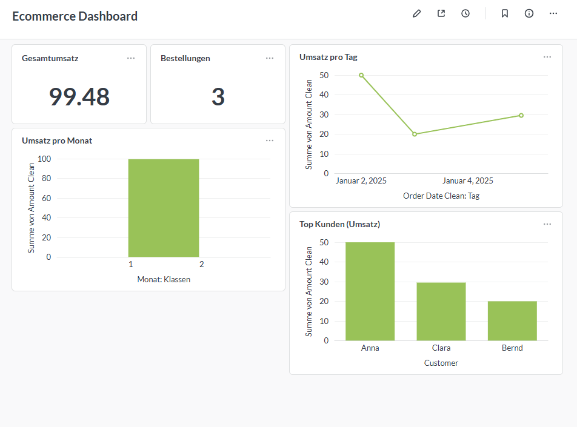

# E-Commerce Analytics Pipeline

Dieses Projekt zeigt eine komplette End-to-End Datenpipeline:
CSV/Excel → Cloud-PostgreSQL (Supabase) → Python ETL → Datenmodellierung → Dashboard in Metabase.

Das Ziel ist eine wiederverwendbare Pipeline, mit der rohe E-Commerce-Daten
automatisch bereinigt, in einer Cloud-Datenbank gespeichert und über ein interaktives Dashboard visualisiert werden.

##  Features

- Automatisierter CSV-Import (ETL) mit Python
- Cloud-Datenbank auf PostgreSQL (Supabase)
- Bereinigtes Datenmodell (`orders_clean`)
- Interaktive Visualisierung in Metabase:
  - Umsatz pro Monat
  - Umsatz pro Kunde
  - Gesamtumsatz (KPI)
  - Anzahl Bestellungen (KPI)
- Wiederverwendbare Struktur für zukünftige Projekte oder echte Kundendaten

##  Technologie-Stack

- **Python 3**
  - pandas
  - psycopg2
  - python-dotenv
- **PostgreSQL (Supabase CLOUD Instance)**
- SSL-gesicherte Verbindung
- **Metabase (lokal über JAR gestartet)**

## 📁 Projektstrukturen

datauebung/
│
├── data/ # CSV- oder Excel-Dateien (Rohdaten)
├── etl/ # ETL-Skripte (CSV → PostgreSQL)
│ └── load_csv_to_postgres.py
├── dashboard/ # Screenshots aus Metabase
├── docs/ # Dokumentation, Diagramme (optional)
├── .env.example # Beispiel für Umgebungsvariablen
├── README.md # Projektdokumentation
└── requirements.txt # Python-Abhängigkeiten

## ⚙️ Setup & Installation

### 1. Repository klonen

git clone <https://github.com/Dario-Vujnovic/ecommerce-analytics-template.git>

### 2. Virtuelle Umgebung erstellen

python -m venv venv
venv\Scripts\activate

### 3. Dependencies installieren

pip install -r requirements.txt

### 4. `.env` Datei anlegen

Erstelle eine `.env` basierend auf `.env.example`:

DB_HOST=...
DB_PORT=5432
DB_NAME=postgres
DB_USER=postgres
DB_PASSWORD=...

### 5. ETL Pipeline ausführen

python etl/load_csv_to_postgres.py

### 6. Metabase starten

java -jar metabase.jar

Metabase öffnen unter:

http://localhost:3000

Datenbank verbinden → Dashboard anzeigen.

### Ollama installieren (für lokale KI-Verarbeitung)

Ollama ist nicht im Repository enthalten. Bitte separat installieren:

Windows:
https://ollama.com/download

Nach Installation prüfen:
ollama --version

s
